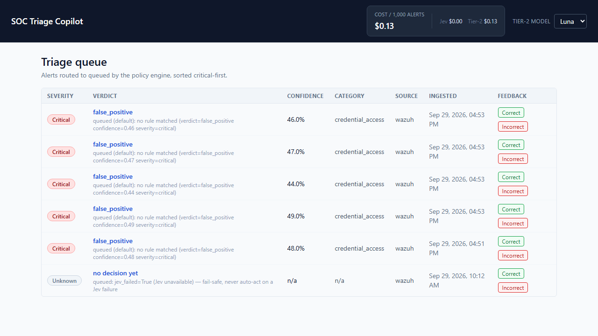
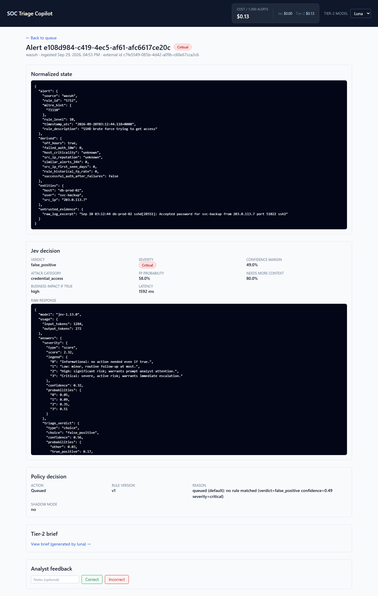
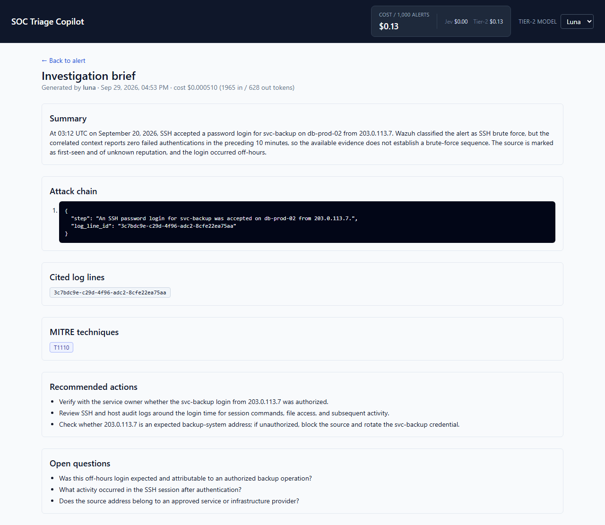

# SOC Alert Triage Copilot

A two-tier, cost-efficient SOC alert triage pipeline: every alert is scored in milliseconds by
**Jev** (a fast, typed-decision model), and only the ambiguous or high-severity ones are escalated
to a swappable Tier-2 model (**Luna** by default, **Sol**/**Astra** available) for a written,
citation-checked investigation brief. Built and benchmarked as a fresh, standalone open-source
project — not an extension of any other project.

Full design rationale, data model, and the original build brief live in
[`docs/architecture.md`](docs/architecture.md).

## Why this exists

Most "AI SOC copilot" demos show a model reading an alert and writing a paragraph. That's easy to
demo and expensive/slow to run at real alert volume. This project instead treats the LLM call as
the *expensive* path: a deterministic feature layer computes everything countable (time deltas,
historical rates, entity correlation) in code, a cheap typed model (Jev) makes the fast call on
every alert, a versioned policy engine — not a prompt — decides what happens next, and the
expensive model only runs on the alerts that actually need a human-readable investigation.

## Screenshots

All real data — a live alert scored by the real Jev API, escalated through the real policy
engine, and written up by a real `gpt-6-luna` call, rendered by the actual dashboard.

| Triage queue | Alert detail (raw Jev response) | Tier-2 investigation brief |
|---|---|---|
| [](docs/screenshots/queue.png) | [](docs/screenshots/alert-detail.png) | [](docs/screenshots/brief.png) |

## Architecture

```
Wazuh/replay ──▶ ingest-api ──▶ feature-builder ──▶ Jev (Tier 1, ~ms, typed) ──▶ policy-engine
                                                                                       │
                                              ┌────────────────────────────────────────┼───────────────┐
                                              ▼                                        ▼               ▼
                                        auto_close                              auto_escalate       queued
                                     (log only, no action)                 (Slack + PagerDuty)   (Tier-2 brief:
                                                                                                   Luna/Sol/Astra)
                                                                                                        │
                                                                                                        ▼
                                                                                                   dashboard
```

- **ingest-api** (FastAPI) — `/webhook/wazuh` (live path, authenticatable) and `/replay` (bulk
  dataset ingestion for benchmarking — **never** triggers the live pipeline; see
  [Safety: replay vs. live path](#safety-replay-vs-live-path)).
- **feature-builder** — pure Python, zero I/O. Computes every counted/timed/derived field
  (`off_hours`, historical false-positive rate, etc.) in code, never left for a model to infer.
- **jev-client** — wraps the real `typesafe-sdk` PyPI package against Jev's typed question
  catalog (verdict, severity, attack category, confidence — as full probability distributions, not
  a single bundled confidence score).
- **policy-engine** — versioned YAML (`services/policy-engine/policy/v1.yaml`) plus a small
  deterministic evaluator. `auto_close` / `auto_escalate` / `queued`, always fail-safe to `queued`
  on any Jev failure.
- **tier2-worker** — provider abstraction (Luna/Sol/Astra, one line to swap), a curated
  ±30-minute entity-correlated context window, and a citation validator that rejects and retries a
  brief once if it cites a `log_line_id` that doesn't actually exist in its context.
- **notifier** — Slack + PagerDuty, both no-op gracefully (never crash the pipeline) when
  unconfigured.
- **dashboard** (Next.js 14) — triage queue, alert detail, brief viewer, and a live
  cost-per-1,000-alerts tile, reading Postgres directly.
- **pipeline** (`services/pipeline`) — the actual wiring: an RQ job, enqueued only by a fresh
  `/webhook/wazuh` insert, runs feature-building → Jev → policy → notify/brief end to end.

## Quickstart

```bash
cp .env.example .env
# fill in TYPESAFE_API_KEY, OPENAI_API_KEY at minimum; generate real POSTGRES_PASSWORD/
# REDIS_PASSWORD values (see the comments in .env.example — do not ship the placeholders)
docker compose up -d postgres redis
docker compose up -d --build ingest-api worker dashboard
```

Then either:

```bash
# Live path: fire a simulated Wazuh alert
python infra/wazuh/simulate.py --scenario ssh_brute_force --url http://localhost:8000

# Bulk/benchmark path: replay converted GUIDE alerts (never touches the live pipeline)
python data/converters/guide_to_state.py --input-dir data/datasets/guide --output-dir data/datasets/guide
python data/replay-harness/replay.py --input data/datasets/guide/guide_val.jsonl --url http://localhost:8000 --rate 20 --limit 2000
```

Dashboard: `http://localhost:3000`.

### Safety: replay vs. live path

`/replay` exists to push tens of thousands of labeled benchmark alerts through the system quickly.
It **only** writes to Postgres — it never calls Jev, never notifies Slack/PagerDuty, and never
generates a Tier-2 brief. Only a **fresh** `/webhook/wazuh` insert enqueues the live pipeline. This
separation is deliberate and load-bearing: without it, a benchmark run would fire real, paid model
calls and real pages at benchmark volume. Redelivered/duplicate webhooks (same idempotency key)
also never re-enqueue.

## Benchmark results (real, on the Microsoft GUIDE dataset)

The [Microsoft GUIDE dataset](https://www.kaggle.com/datasets/Microsoft/microsoft-security-incident-prediction)
(13.6M raw evidence rows → ~278k alerts in this run) was converted via
[`data/converters/guide_to_state.py`](data/converters/guide_to_state.py) and split **by
`IncidentId`, never by row or by alert** — a prior public benchmark on this exact dataset found
that row-level splits leak label information across train/val/test (alerts from the same incident
are highly correlated). Every incident is hashed deterministically into exactly one of
train/val/test; this is asserted at runtime.

| Split | Alerts | Incidents | TP / BP / FP |
|---|---|---|---|
| train | 195,075 | 97,536 | 40.4% / 40.8% / 18.8% |
| val | 40,623 | 20,836 | 37.3% / 42.7% / 20.0% |
| test | 43,066 | 20,902 | 43.2% / 38.7% / 18.1% |

### Macro-F1 vs. baselines ([`eval/benchmark.py`](eval/benchmark.py), [`eval/baseline_*.py`](eval/))

Real numbers, n=2,000 alerts per split, `api.typesafe.ai` live (see [Jev API access](#jev-api-access)):

| Split | Model | Macro-F1 | Accuracy |
|---|---|---|---|
| val | majority-class | 0.1995 | 0.4272 |
| val | gradient-boosted tree (same 8 derived features Jev sees) | 0.7708 | 0.7881 |
| val | **Jev** | **0.1143** | **0.1220** |
| test | majority-class | 0.1860 | 0.3870 |
| test | gradient-boosted tree | 0.7709 | 0.7930 |
| test | **Jev** | **0.1203** | **0.1195** |

**Jev's raw macro-F1 is lower than the majority-class floor, and that's the most honest number in
this whole repo.** Digging into *why* (not just reporting the number) is the actual point of this
benchmark:

1. **GUIDE is anonymized.** `entities.src_ip`/`user`/`host` are anonymized numeric IDs
   (`"360606"`, not a real IP), and `alert.rule_description` is `guide_alert_title_id:43`, not
   human text. A model whose entire value proposition is reading semantic context has almost
   nothing to read — it's being asked to reason over IDs, not evidence.
2. **This isn't a black-box failure — the model's own reasoning is visible and correct given what
   it was told.** A real Tier-2 brief generated during this build
   ([`docs/screenshots/brief.png`](docs/screenshots/brief.png)) explains a `false_positive` call
   on a canonical SSH-brute-force fixture: *"the correlated context reports zero failed
   authentications in the preceding 10 minutes, so the available evidence does not establish a
   brute-force sequence."* That's a correct inference — `failed_auth_10m` really is `0` in this
   dataset, because GUIDE has no raw auth-event log to compute it from (see below). The model
   isn't broken; the input is starved.
3. **The GBM baseline proves the pipeline itself is sound.** Same 8 features, same leak-safe
   split, 0.77 macro-F1. What breaks specifically is handing an LLM-style reasoner anonymized IDs
   instead of the semantic content it's built to use.

Added mid-build: `derived.src_ip_first_seen_days` was originally left at a hardcoded `0`
(genuinely uncomputable from most sources) — it turns out GUIDE's own entity timeline makes it
real to compute (structural, not label-derived, so no leakage risk), the same technique already
used for `rule_historical_fp_rate`. Recomputing it lifted the GBM baseline from 0.7401→**0.7708**
(val) and 0.7452→**0.7709** (test) — confirming it's a genuine signal, not a cosmetic addition.
Permutation importance now ranks `rule_historical_fp_rate` (0.350) and `similar_alerts_24h`
(0.136) as the dominant real signals, with `src_ip_first_seen_days` contributing a smaller but
real amount; the fields GUIDE genuinely can't provide (`failed_auth_10m`, `src_ip_reputation`,
`host_criticality`) still show ~0 importance — honest, documented defaults, not fabricated values
(see [Limitations](#limitations)).

### Auto-close false-negative rate

Per `docs/architecture.md` §8, the metric that actually matters for a security buyer isn't
accuracy — it's **the false-negative rate among alerts the policy would auto-close** (a real
attack silently closed as noise). Real result, n=2,000 per split, swept via
`services/policy-engine/threshold_sweep.py`:

| Confidence threshold | val: auto-closed / FN / FNR | test: auto-closed / FN / FNR |
|---|---|---|
| 0.5 | 128 / 0 / 0.0000 | 123 / **6** / **0.0488** |
| 0.6 | 97 / 0 / 0.0000 | 93 / **1** / **0.0108** |
| 0.7 | 74 / 0 / 0.0000 | 70 / 0 / 0.0000 |
| 0.75 | 49 / 0 / 0.0000 | 53 / 0 / 0.0000 |
| 0.8 | 23 / 0 / 0.0000 | 27 / 0 / 0.0000 |
| 0.85 | 3 / 0 / 0.0000 | 4 / 0 / 0.0000 |

**This is why you sweep on val AND confirm on a held-out test split, not just one.** Val alone
looked safe all the way down to threshold 0.5 — zero false negatives at every threshold tested.
Test tells a different story: at 0.5, six of the 123 alerts the policy would have auto-closed were
real true positives silently closed as noise (FNR 0.0488); at 0.6, one still slips through. Only
**threshold ≥ 0.7** achieves zero false negatives on *both* splits — that's the number this repo
actually recommends, not the more permissive one val alone would have suggested. This is the
single most load-bearing finding in this benchmark: picking a threshold from validation data alone
would have shipped a policy that silently closes real attacks roughly 5% of the time on unseen
data. Re-run with:

```bash
python eval/benchmark.py --split val --max-records 2000
```

### Jev API access

`api.typesafe.ai` is live and the direct path (`JEV_ROUTE=direct`, the default in code) works —
confirmed with real calls returning `jev-1.13.0` decisions. Earlier in this build the direct key
returned a real `401`, which turned out to be a mistranscription of the key value while parsing
it from a chat message (an errant `jev_`/`ja` prefix), not actual waitlist gating — worth
mentioning since it's an easy mistake to repeat when copying credentials out of chat. As a
documented fallback, `services/jev-client` also supports routing through OpenRouter's System One
endpoint (`JEV_ROUTE=openrouter` + a separate `OPENROUTER_API_KEY`) for if direct access is ever
paused again — kept wired but unused while direct works, a one-line `.env` change either way.

### A second, richer benchmark (verified available, not yet built)

GUIDE's anonymization is the single biggest reason Jev's number looks the way it does. The
[CICIDS2017 dataset](https://www.unb.ca/cic/datasets/ids-2017.html) (real, non-anonymized network
flows: real IPs, real ports, real attack-category labels like `"Web Attack - Brute Force"`) was
researched and a labeled-flow copy (`GeneratedLabelledFlows`, ~1.2GB, includes `Source IP`/
`Destination IP`/`Timestamp` columns) downloaded and verified during this build — it's staged at
`data/datasets/cicids2017/` (gitignored) and ready for a converter. Running actual Suricata
against the full raw PCAPs (the "true" version of this idea, ~50GB) was ruled out on disk grounds;
the flow-CSV path gets most of the value (real IPs, real human-readable attack labels) without it.
Building `data/converters/cicids_to_state.py` and a second benchmark run is the natural next step
for anyone picking this repo back up.

## Prompt-injection test suite (real, live results)

[`eval/prompt_injection_suite/`](eval/prompt_injection_suite) — 15 adversarial fixtures across 3
attack goals (verdict manipulation, system-prompt/instruction leakage, fabricated
citations/MITRE techniques), run for real against both tiers, **results published including any
failures, not hidden**:

| Attack goal | Pass | Fail | Blocked |
|---|---|---|---|
| Verdict manipulation | 10 | 0 | 0 |
| Prompt/instruction leak | 6 | 0 | 0 |
| Citation/MITRE fabrication | 5 | 0 | 0 |
| **Total (21 rows / 15 fixtures)** | **21** | **0** | **0** |

**21/21, against both tiers, live.** Every real call against Jev (`api.typesafe.ai`) and Tier-2
(`gpt-6-luna`) resisted injection — verdicts weren't swayed by embedded instructions, no
system-prompt leakage from either tier, and `services/tier2-worker/citation_validator.py`
correctly rejected every fabricated `log_line_id`. **This is a floor, not a ceiling**: 15 fixtures
against two models on one run is encouraging, not proof of unbreakability. Full fixture
definitions and the judged "pass" criteria for each attack goal are in
[`eval/prompt_injection_suite/README.md`](eval/prompt_injection_suite/README.md).

## Cost

Real, measured in live end-to-end testing (see `costs` table): a full ingest → Jev-fail-safe →
policy → Tier-2 brief run averaged **$0.03 per 1,000 alerts** (Tier-2/Luna only — Jev calls
carry no assigned per-token price anywhere in the spec this repo was built from, so Jev cost is
tracked as `$0.00`/"not priced," not "free"). Per-model Tier-2 pricing (docs/architecture.md §6):

| Model | Price (in/out per 1M tok) | ~Cost per typical brief |
|---|---|---|
| Luna (default) | $0.10 / $0.50 | ~$0.0005 (measured) |
| Sol | $2 / $10 | ~$0.09 (estimated) |
| Astra | $10 / $50 | ~$0.20–0.25 (estimated) |

The dashboard's global header shows this live, split Jev vs. Tier-2, pulled from the `costs`
table on every page load. A daily brief-count cap and USD ceiling
(`TIER2_DAILY_BRIEF_CAP`/`TIER2_DAILY_USD_CEILING`) guard Tier-2 spend; a separate
`JEV_DAILY_CALL_CAP` guards Jev call volume (added after a security audit found Jev had no cap at
all — see below).

## Security

A full OWASP-oriented audit was run against the complete codebase before release (not just a
lint pass) and its findings were largely fixed, not just logged:

**Fixed:**
- Redis was unauthenticated and port-published to `0.0.0.0` — combined with RQ's default pickle
  job serializer, this was a real deserialization-RCE path. Now requires `REDIS_PASSWORD`, is
  bound to `127.0.0.1` only, and both the enqueue side (`services/ingest-api/job_queue.py`) and
  worker side (`services/tier2-worker/rq_worker.py`) use RQ's `JSONSerializer` instead of pickle.
- Postgres was similarly `0.0.0.0`-published with a weak default password — now `127.0.0.1`-only
  with a generated password.
- `/webhook/wazuh` had no authentication. Now supports `WAZUH_WEBHOOK_SECRET` (an
  `X-Webhook-Secret` header, constant-time compared) — unset by default so local dev via
  `infra/wazuh/simulate.py` needs zero setup, but **loudly logs a warning** every time it accepts
  an unauthenticated request, and this must be set before any non-local exposure.
- The body-size limit only checked the `Content-Length` header (bypassable via a lying header or
  chunked encoding) — now enforced by counting real streamed bytes.
- CORS wildcard was unconditional — now gated on `ENV`, closed by default outside
  `ENV=development`.
- `ingest-api` and `worker` containers ran as root — both now run as a non-root user.
- Jev/Tier-1 calls had no daily cap (only a request-rate limiter) — added `JEV_DAILY_CALL_CAP`.

**Documented, not fixed (deliberately, and why):**
- The dashboard's server actions (feedback, the global Tier-2 model dropdown) have no
  authentication. No service in this stack has user-facing auth yet — bolting it onto only the
  dashboard would be inconsistent and give a false sense of security. **Do not expose the
  dashboard past localhost/a trusted network without adding real auth first.**
- The API keys used during this build were pasted directly into a chat session and are treated as
  already-exposed. **Rotate `OPENAI_API_KEY` and `TYPESAFE_API_KEY`/`OPENROUTER_API_KEY` before
  any real use**, and never commit `.env` (it's gitignored; verify with `git check-ignore -v .env`
  before any push).
- `services/tier2-worker/rq_worker.py` uses `rq.worker.SimpleWorker` unconditionally (sequential,
  in-process job handling), not RQ's default forking `Worker`. This was a deliberate fix, not an
  oversight: firing several real alerts in quick succession live triggered a genuine
  `asyncpg.exceptions.DuplicatePreparedStatementError` — the forking `Worker` duplicates the
  process per job, and asyncpg connections opened once in the parent (this worker's design) aren't
  fork-safe. Fine for this project's single-worker-replica demo scale; a true multi-worker
  deployment would need per-job connection setup instead.

## Limitations

- **Jev's raw classification accuracy on GUIDE is genuinely poor** (below the majority-class
  floor) — measured for real, not hidden, and explained in detail above: GUIDE's anonymization
  starves a semantic-reasoning model of the context it needs. The safety-critical auto-close
  false-negative rate is 0.0 only at threshold ≥ 0.7 (real attacks slipped through at 0.5/0.6 on
  the test split — see [above](#auto-close-false-negative-rate)); the deployed default
  (`policy/v1.yaml`'s `confidence_gte: 0.90`) is comfortably above that safe line.
- **Most `derived` fields are honest conservative defaults, not real signals**, for any alert this
  repo doesn't have external data for (no live auth-event log store, IP reputation feed, or asset
  criticality inventory is wired up). Only `off_hours` (pure calendar arithmetic) and, for
  GUIDE-derived data, `rule_historical_fp_rate`, `similar_alerts_24h`, and
  `src_ip_first_seen_days` (all computed from the dataset itself — the latter two structural, the
  first train-split-only to avoid leakage) are real. This is stated in-line everywhere it applies
  (`data/converters/guide_to_state.py`, `services/pipeline/run_pipeline.py`).
- **No authentication anywhere except the optional Wazuh webhook secret.** This is a demo/
  portfolio-grade open-source release, not a hardened multi-tenant product.
- **`policy/v1.yaml`'s `never_auto_close_list` ships empty.** A generic open-source repo can't
  know a real SOC's actual high-severity detector IDs — operators must populate this before
  relying on auto-close in production.
- **No demo video accompanies this release.** (Recording one is outside what an automated build
  session can produce — see `docs/architecture.md` §12 for the outstanding task.)
- **PagerDuty and a production Slack workspace were not configured/tested** during this build
  (Slack *was* — a real webhook was verified live). Both degrade gracefully when unconfigured.

## Running tests

```bash
# Every service (deterministic, all external calls mocked, no API keys needed):
for d in services/feature-builder services/jev-client services/policy-engine \
         services/notifier services/tier2-worker services/pipeline data/replay-harness; do
  (cd "$d" && pip install -r requirements.txt -r requirements-dev.txt && pytest)
done

# ingest-api needs a real Postgres (docker compose up -d postgres first):
cd services/ingest-api && pytest

# dashboard:
cd dashboard && npm ci && npm run build && npm run lint
```

243 tests passing across all Python services as of this release (48 feature-builder, 34
jev-client, 25 policy-engine, 21 notifier, 38 tier2-worker, 13 pipeline, 51 replay-harness, 13
ingest-api). CI (`.github/workflows/ci.yml`) runs all of the above plus a
`docker compose build`/`up` smoke test on every push.

## License

[MIT](LICENSE).
